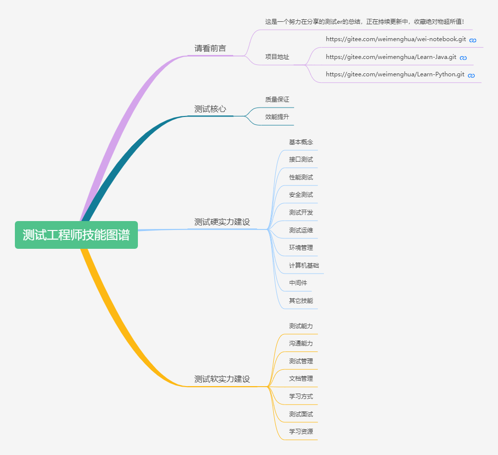
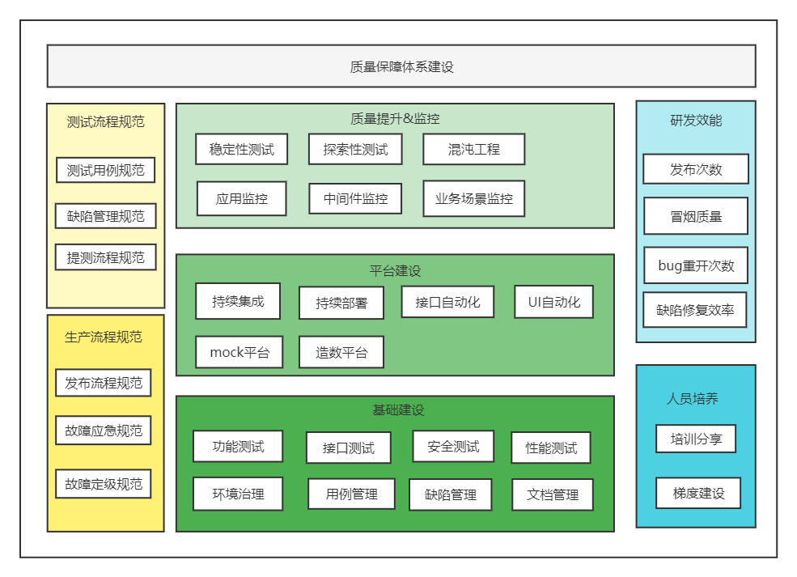

[TOC]

<h1 style="text-align:center">好好学习, 天天向上</h1>
<h3 style="text-align:center">这是一个努力建设知识体系的呱呱大王</h3>

---

## 1、项目简介
- wei-notebook  
  - 项目说明：包含 Ansible，MySQL，Docker，Git，Jenkins，JMeter，Linux，Shell，Pipeline，中间件：Dubbo、 Kafka、Nginx、nodejs、Redis、RocketMQ、Zookeeper 等总结。
  - https://github.com/WEIMHaaa/wei-notebook.git
  - https://gitee.com/weimenghua/wei-notebook.git
- Learn-Java
  - 项目说明：学习Java和vue的项目，包含Java基础，SpringBoot，Vue等。
  - https://github.com/WEIMHaaa/Learn-Java.git  
  - https://gitee.com/weimenghua/Learn-Java.git
- Learn-Python
  - 项目说明：学习Python的项目，包含Python基础，pytest，unitest，selenium等测试框架。
  - https://github.com/WEIMHaaa/Learn-Python.git
  - https://gitee.com/weimenghua/Learn-Python.git
 
  
## 2、测试工程师技能图谱
在线地址：[测试工程师技能图谱](https://www.processon.com/view/link/615eae81e0b34d06f3dcdf4b)  
本地文件：[./docs/测试工程师技能图谱.xmind](./docs/测试工程师技能图谱.xmind)  
  

## 3、质量保障体系建设
在线地址：[质量保障体系建设](https://www.processon.com/view/link/62526ac61efad407891c5dd5)  
本地文件：[./docs/质量保障体系建设.pdf](./docs/质量保障体系建设.pdf)

## 4、联系作者
关于软件测试，如果有什么想法，可以加个vx交流一下。

## 5、公众号
### 5.1、嘎嘎软件测试
  

### 5.2、[文章索引](https://mp.weixin.qq.com/s?__biz=MzkwODI2OTQ4Ng==&mid=2247484664&idx=1&sn=e7fd3c5bddcbea752b75cd5806f7861a&chksm=c0cdc639f7ba4f2f6c4f8d110a2531b81db49819c514a2cd48c81e09ec4af6e7f136144946b9&token=1173117238&lang=zh_CN#rd)
#### Docker系列
  - [【Docker系列】docker-compose一步帮你搞定n个容器](https://mp.weixin.qq.com/s/mF3JvSbYByHpv0ToV0XglA)  
  - [【Docker系列】镜像and容器基本操作](https://mp.weixin.qq.com/s/8ygeEwgeli4_fzMm4jJhNA)  
  - [【Docker系列】手把手教你写Dockerfile](https://mp.weixin.qq.com/s/4W--8WYBc34cqW0Vz3fQaQ)  
  - [【Docker系列】我的Docker入门历程](https://mp.weixin.qq.com/s/qDLcyNlg5XzOteW9M1b_vw)  

#### Dubbo系列
  - [【Dubbo系列】Dubbo是啥？RPC又是啥？](https://mp.weixin.qq.com/s/I3qOFitAFhdD8GKw-YXy7A)
  - [【Dubbo系列】命令行调用dubbo接口](https://mp.weixin.qq.com/s/guMigJE7vYMGkDgPOQq1Aw)  

#### Git系列
  - [【Git系列】带你入门Git](https://mp.weixin.qq.com/s/qsgt-UmNxOlbUpumsYAFFA)  
  - [【Git系列】本地项目同时关联github和gitee](https://mp.weixin.qq.com/s/KNeVQWrp5dLdK7RXDGwEHg)  

#### Java系列
  - [【Java系列】crud工程师的swagger接口管理](https://mp.weixin.qq.com/s/btFInSxiw07PFa3BBnENFA)
  - [【Java系列】八大排序算法](https://mp.weixin.qq.com/s/MFdMgnxB0MHDX9SP3DecRQ)

#### Jenkins系列
  - [【Jenkins系列】如何搭建Jenkins环境](https://mp.weixin.qq.com/s/9nHMGpt5FYMMIKCR54mdrA)  
  - [【Jenkins系列】如何构建Jenkins Job](https://mp.weixin.qq.com/s/sYMobgHghGe0JTvlYAPPNQ)  
  - [【Jenkins系列】什么是pipeline](https://mp.weixin.qq.com/s/VLmBT6fbW_poOg6fb8YwVg)  
  - [【Jenkins系列】自动化构建](https://mp.weixin.qq.com/s/y5DcJ6zPEfqpF3ZXzFwuNg)  

#### Linux系列
  - [【Linux系列】三剑客awk，sed，grep](https://mp.weixin.qq.com/s/9tmR_UxUcaJ1LK2rOlIGrw)  

#### Python系列
  - [【Python系列】pytest自动化测试框架](https://mp.weixin.qq.com/s/dKgvH8igE9sjtsu91hxpdw)  
  - [【Python系列】为啥老问装饰器、迭代器、生成器？](https://mp.weixin.qq.com/s/8WxDiqZ48bo0ymNG5d4oew)  

#### Redis系列
  - [【Redis系列】Java使用Redis](https://mp.weixin.qq.com/s/lXCxdE9lEah9XautS315vQ)  
  - [【Redis系列】一文带你入门Redis](https://mp.weixin.qq.com/s/zLfHWg4xEd75rB12GOUcMg)  

#### shell系列
  - [【shell系列】环境管理必备工具shell](https://mp.weixin.qq.com/s/j2IAM1sIGz7-9bRNqx5-jg) 

#### 笔记总结
  - [【笔记总结】我是如何做笔记的](https://mp.weixin.qq.com/s/UVPVRU7t6Vzx3y_3iDC5sg)  

#### 查看日志
  - [【查看日志】教你查看日志的N种方式](https://mp.weixin.qq.com/s/XIWUnQIs3JuIGWyhdqznEw)
  - [【查看日志】一文详解cdlog](https://mp.weixin.qq.com/s/G8q_nwYTJaYxxAikcNROMQ)  

#### 接口测试
  - [【接口测试】JMeter接口关联测试](https://mp.weixin.qq.com/s/Daf2zhY4yVPBK9_Wo27vbg)  
  - [【接口测试】JMeter连接MySQL](https://mp.weixin.qq.com/s/11mYbCpCH0su4aOGa2aHIA)
  - [【接口测试】JMeter强化神器beanshell](https://mp.weixin.qq.com/s/DKPtUf7M42h4-It2yURPpA)  
  - [【接口测试】神器JMeter](https://mp.weixin.qq.com/s/mFjg3Spwv2snsz-12yQ08A)  
  - [【接口测试】JMeter参数化](https://mp.weixin.qq.com/s/8LMlc54lmdlrcUGOPIyIHw)  
  - [【接口测试】JMeter测试WebSocket接口](https://mp.weixin.qq.com/s/65kzy2FL4cxSwc4fwz14NQ)

#### 金融风控
  - [【金融风控】风控基础总结](https://mp.weixin.qq.com/s/NoDITA9TtOePzR-KGCIGBQ)  

#### 面试系列
  - [【面试系列】你是如何做接口测试的？](https://mp.weixin.qq.com/s/d5mQpyiA98I1axTzGOIaPQ)
  - [【面试系列】如果你是测试Leader，你会怎么做？](https://mp.weixin.qq.com/s/kGaEWd1u09uLD2Mu_akIsA)
  - [【面试系列】如何保障质量之测试左移右移](https://mp.weixin.qq.com/s/nbE16LyZtrKq3lla5VxM7Q)
  - [【面试系列】这个调整，我花了2年时间......](https://mp.weixin.qq.com/s/MtnQ9qJoB_Okg1LSrHH79A)  

#### 软件测试点
  - [【软件测试点】一切都在细节中](https://mp.weixin.qq.com/s/GJkXOB9i0sE8VKc6z-e_2g)  

#### 数据库系列
  - [【数据库系列】你想要的sql全都有](https://mp.weixin.qq.com/s/Wuzutb5IZTOgSHkC6yRj6w)  
  - [【数据库系列】你想要的sql全都有plus](https://mp.weixin.qq.com/s/_uTqNUzs4ebEB-JVBplXHA)  
  - [【数据库系列】Elasticsearch基本操作](https://mp.weixin.qq.com/s/n5N0gFeUatirur_AxW2p8Q)  
  - [【数据库系列】Elasticsearch入门](https://mp.weixin.qq.com/s/5PWsTGEafyJY1C43fsYWWA)  
  - [【数据库系列】隔离级别会造成我转账1个亿丢失吗？](https://mp.weixin.qq.com/s/MxUj7mFThT_qRuKCR8hjMA)
  - [【数据库系列】环境治理之同步数据库](https://mp.weixin.qq.com/s/gefcEFnYDH4iWNsvKXG4DQ)  

#### 碎碎念
  - [【碎碎念】恍然大悟真的很妙](https://mp.weixin.qq.com/s/L4Fw-LuArh0epzbE-yj1mg)
  - [【碎碎念】你说这是图啥呢](https://mp.weixin.qq.com/s/RZsEQNngZnQMmFb1-zf5jA)  
  - [【碎碎念】如果你也觉得人生好无聊，进来看看吧](https://mp.weixin.qq.com/s/jlOTN2aaZpak1Kl0dStiMg)  
  - [【碎碎念】三年前她是这样的...](https://mp.weixin.qq.com/s/BpKIEh4G9UF6zyVtjBScCQ)  
  - [【碎碎念】为什么要《好好学习》？](https://mp.weixin.qq.com/s/rzgl6NyLnuhrGFV2WP0AWQ)
  - [【碎碎念】无为而治](https://mp.weixin.qq.com/s/-9FGqv1Kjx09eF6WK66CbQ)
  - [【碎碎念】一个人吃烤肉](https://mp.weixin.qq.com/s/sf3I-ASODotshOLrEzd7Tw)

#### 投资理财
  - [【投资理财】看，这小白菜多绿啊~](https://mp.weixin.qq.com/s/vb7trTy0s4rSSfEAbHsSvw)  
  - [【投资理财】人人都是基金经理](https://mp.weixin.qq.com/s/EgjQlYcWv02Bt_Hb-PIkuQ)

#### 文档管理
  - [【文档管理】关于重构，我的一点看法](https://mp.weixin.qq.com/s/t2yswJAJFkRJ7au7fs5oZQ)  
  - [【文档管理】靠着这项技能，我成长了......](https://mp.weixin.qq.com/s/K5sYqqaPso7YoNrFYvkLxQ)  

#### 小工具
  - [【小工具】txt和csv互转，一键搞定~](https://mp.weixin.qq.com/s/RGw_IvhQkf7IXxo76S5oLA)  
  - [【小工具】反编译指南](https://mp.weixin.qq.com/s/Mgjct_a87PxPzQaCFUzOOg)  
  - [【小工具】批量造PDF文件demo](https://mp.weixin.qq.com/s/n5Azyun4-PfFgjxngAzxkg)  

#### 抓包工具
  - [【抓包工具】whistle入门](https://mp.weixin.qq.com/s/44Va8lN28qqrZvcrbe91eg)  

#### 自动化测试
  - [【自动化测试】是否有必要做自动化测试？](https://mp.weixin.qq.com/s/9k_LcRxp-fpttS6wI58bYA) 
  - [【自动化测试】一站式测试平台MeterSphere实践感悟分享](https://mp.weixin.qq.com/s/7lIXh-w01mPxx-RKLNG9NA)  

#### 自动化运维
  - [【自动化运维】从0到1 CICD自动化部署落地分享](https://mp.weixin.qq.com/s/cd-eCw3lot0NuRY56wuflQ)
  - [【自动化运维】带你入门ansible](https://mp.weixin.qq.com/s/owCkdZDgIKzGFe4FIHiYhA)  
