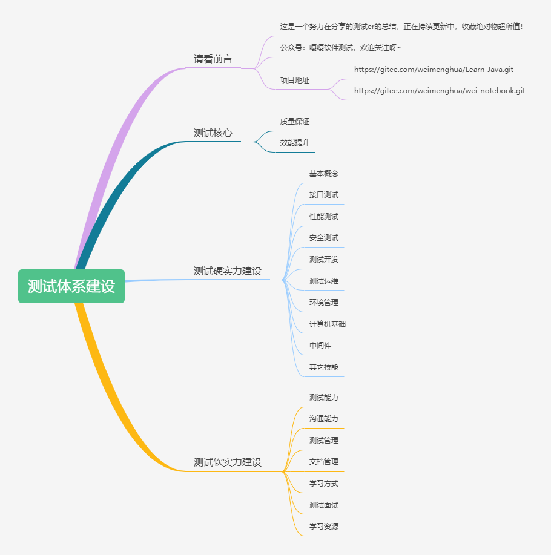

# 好好学习, 天天向上

## 1、项目地址
- Learn-Java
  - https://github.com/WEIMHaaa/Learn-Java.git
  - https://gitee.com/weimenghua/Learn-Java.git
- wei-notebook
  - https://github.com/WEIMHaaa/wei-notebook.git
  - https://gitee.com/weimenghua/wei-notebook.git

## 2、[测试建设体系](https://www.processon.com/view/link/615eae81e0b34d06f3dcdf4b)
本地文件：[./docs/测试体系建设.xmind](./docs/测试体系建设.xmind)

## 3、公众号
### [嘎嘎软件测试历史文档引路](https://mp.weixin.qq.com/s?__biz=MzkwODI2OTQ4Ng==&mid=2247484664&idx=1&sn=e7fd3c5bddcbea752b75cd5806f7861a&chksm=c0cdc639f7ba4f2f6c4f8d110a2531b81db49819c514a2cd48c81e09ec4af6e7f136144946b9&token=1173117238&lang=zh_CN#rd)

### 文章索引
- Docker系列
  - [【Docker系列】docker-compose一步帮你搞定n个容器](https://mp.weixin.qq.com/s/mF3JvSbYByHpv0ToV0XglA)
  - [【Docker系列】镜像and容器基本操作](https://mp.weixin.qq.com/s/8ygeEwgeli4_fzMm4jJhNA)
  - [【Docker系列】手把手教你写Dockerfile](https://mp.weixin.qq.com/s/4W--8WYBc34cqW0Vz3fQaQ)
  - [【Docker系列】我的Docker入门历程](https://mp.weixin.qq.com/s/qDLcyNlg5XzOteW9M1b_vw)

- Dubbo系列
  - [【Dubbo系列】命令行调用dubbo接口](https://mp.weixin.qq.com/s/guMigJE7vYMGkDgPOQq1Aw)

- Git系列
  - [【Git系列】带你入门Git](https://mp.weixin.qq.com/s/qsgt-UmNxOlbUpumsYAFFA)
  - [【Git系列】本地项目同时关联github和gitee](https://mp.weixin.qq.com/s/KNeVQWrp5dLdK7RXDGwEHg)

- Jenkins系列
  - [【Jenkins系列】如何搭建Jenkins环境](https://mp.weixin.qq.com/s/9nHMGpt5FYMMIKCR54mdrA)
  - [【Jenkins系列】如何构建Jenkins Job](https://mp.weixin.qq.com/s/sYMobgHghGe0JTvlYAPPNQ)
  - [【Jenkins系列】什么是pipeline](https://mp.weixin.qq.com/s/VLmBT6fbW_poOg6fb8YwVg)
  - [【Jenkins系列】自动化构建](https://mp.weixin.qq.com/s/y5DcJ6zPEfqpF3ZXzFwuNg)

- Redis系列
  - [【Redis系列】Java使用Redis](https://mp.weixin.qq.com/s/lXCxdE9lEah9XautS315vQ)
  - [【Redis系列】一文带你入门Redis](https://mp.weixin.qq.com/s/zLfHWg4xEd75rB12GOUcMg)

- shell系列
  - [【shell系列】环境管理必备工具shell](https://mp.weixin.qq.com/s/j2IAM1sIGz7-9bRNqx5-jg)

- 笔记总结
  - [【笔记总结】我是如何做笔记的](https://mp.weixin.qq.com/s/UVPVRU7t6Vzx3y_3iDC5sg)

- 查看日志
  - [【查看日志】教你查看日志的N种方式](https://mp.weixin.qq.com/s/XIWUnQIs3JuIGWyhdqznEw)
  - [【查看日志】一文详解cdlog](https://mp.weixin.qq.com/s/G8q_nwYTJaYxxAikcNROMQ)

- 接口测试
  - [【接口测试】JMeter接口关联测试](https://mp.weixin.qq.com/s/Daf2zhY4yVPBK9_Wo27vbg)
  - [【接口测试】JMeter强化神器beanshell](https://mp.weixin.qq.com/s/DKPtUf7M42h4-It2yURPpA)
  - [【接口测试】神器JMeter](https://mp.weixin.qq.com/s/mFjg3Spwv2snsz-12yQ08A)
  - [【接口测试】JMeter参数化](https://mp.weixin.qq.com/s/8LMlc54lmdlrcUGOPIyIHw)

- 面试总结
  - [【面试总结】这个调整，我花了2年时间......](https://mp.weixin.qq.com/s/MtnQ9qJoB_Okg1LSrHH79A)

- 软件测试点
  - [【软件测试点】一切都在细节中](https://mp.weixin.qq.com/s/GJkXOB9i0sE8VKc6z-e_2g)

- 数据库系列
  - [【数据库系列】你想要的sql全都有](https://mp.weixin.qq.com/s/Wuzutb5IZTOgSHkC6yRj6w)
  - [【数据库系列】你想要的sql全都有plus](https://mp.weixin.qq.com/s/_uTqNUzs4ebEB-JVBplXHA)
  - [【数据库系列】Elasticsearch基本操作](https://mp.weixin.qq.com/s/n5N0gFeUatirur_AxW2p8Q)
  - [【数据库系列】Elasticsearch入门](https://mp.weixin.qq.com/s/5PWsTGEafyJY1C43fsYWWA)
  - [【数据库系列】环境治理之同步数据库](https://mp.weixin.qq.com/s/gefcEFnYDH4iWNsvKXG4DQ)

- 碎碎念
  - [【碎碎念】你说这是图啥呢](https://mp.weixin.qq.com/s/RZsEQNngZnQMmFb1-zf5jA)
  - [【碎碎念】如果你也觉得人生好无聊，进来看看吧](https://mp.weixin.qq.com/s/jlOTN2aaZpak1Kl0dStiMg)
  - [【碎碎念】三年前她是这样的...](https://mp.weixin.qq.com/s/BpKIEh4G9UF6zyVtjBScCQ)

- 投资理财
  - [【投资理财】看，这小白菜多绿啊~](https://mp.weixin.qq.com/s/vb7trTy0s4rSSfEAbHsSvw)

- 文档管理
  - [【文档管理】关于重构，我的一点看法](https://mp.weixin.qq.com/s/t2yswJAJFkRJ7au7fs5oZQ)
  - [【文档管理】靠着这项技能，我成长了......](https://mp.weixin.qq.com/s/K5sYqqaPso7YoNrFYvkLxQ)

- 小工具
  - [【小工具】txt和csv互转，一键搞定~](https://mp.weixin.qq.com/s/RGw_IvhQkf7IXxo76S5oLA)
  - [【小工具】反编译指南](https://mp.weixin.qq.com/s/Mgjct_a87PxPzQaCFUzOOg)
  - [【小工具】批量造PDF文件demo](https://mp.weixin.qq.com/s/n5Azyun4-PfFgjxngAzxkg)

- 抓包工具
  - [【抓包工具】whistle入门](https://mp.weixin.qq.com/s/44Va8lN28qqrZvcrbe91eg)

- 自动化测试
  - [【自动化测试】是否有必要做自动化测试？](https://mp.weixin.qq.com/s/9k_LcRxp-fpttS6wI58bYA)

- 自动化运维
  - [【自动化运维】带你入门ansible](https://mp.weixin.qq.com/s/owCkdZDgIKzGFe4FIHiYhA)  