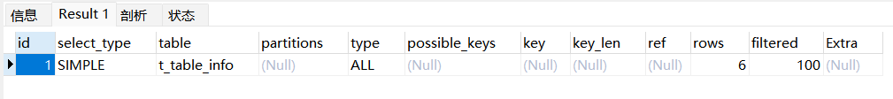

### 一、sql执行过程
Step1：客户端向Mysql服务器发送SQL语句。  
Step2：服务器收到后先查询”查询缓存“，如果命中，从缓存中直接返回sql执行的结果集。否则，进入Step3。  
Step3：服务器解析、预处理、优化sql执行计划，然后将处理好的sql放入查询的执行计划中。  
Step4：执行引擎通过调用”存储引擎”(如，innodb、myisam等)提供的API去执行这个计划。  
Step5：服务器返回结果给客户端。  

### 二、sql的执行顺序（优化动作越靠前越好）
1. from
2. on
3. join
4. where
5. group by
6. avg\sum...
7. having
8. select
9. distinct
10. order by
11. limit            

### 三、sql编写顺序
编写顺序: select distinct from join on where group by having order by limit
```
SELECT DISTINCT < select_list >
FROM < left_table > < join_type >
JOIN < right_table >
ON < join_condition >
WHERE < where_condition >
GROUP BY < group_by_list >
HAVING < having_condition >
ORDER BY < order_by_condition >
LIMIT < limit_number >
```

### 四、sql解析顺序
解析顺序: from on join where group by having select distinct order by limit
```
FROM <left_table>
ON <join_condition> <join_type> 
JOIN <right_table>
WHERE <where_condition>
GROUP BY <group_by_list>
HAVING <having_condition>
SELECT 
DISTINCT <select_list>
ORDER BY <order_by_condition>
LIMIT <limit_number>
```

### 五、sql执行关键字解释
1. Distinct(去重)：用于返回唯一不同的值
2. where子句用于提取那些满足指定条件的记录
3. AND：如果第一个条件和第二个条件都成立，则AND运算符显示一条记录
4. OR：如果第一条和第二个条件中只要有一个条件成立，则OR运算符显示一条记录
5. ORDER BY：用于对结果集按照一个列过分多个列进行排序，默认升序，可以使用DESC改为降序(desc只对紧跟着的第一个列名有效，其他不受影响)
6. LIMIT：选取指定的条数数据，分页查询
7. LIKE：用于在where子句中搜索列中的指定模式，也可以匹配字符串
8. IN：允许在where子句中规定多个值
9. BETWEEN用于选取介于两个值之间的数据范围内的值
10. JOIN：用来将两个或者多个表的行连接起来，基于这些表之间的共同字段
11. UNION：合并两个或者多个select语句的结果,如果允许重复的值使用UNION ALL
12. SELECT INTO：从一个表复制数据，然后将数据插入到另一个新表中
13. 子查询：出现在其他语句内部的select语句，称为子查询或者内查询，内部嵌套其他select语句的查询，称为外查询或主查，子查询的执行优先于主查询的执行，主查询的条件用到了子查询的结果

### 六、sql执行计划explain
通过explain这个命令来查看一个这些SQL语句的执行计划。查看该SQL语句有没有使用上了索引，有没有做全表扫描，这都可以通过explain命令来查看。



#### 概要描述：
1. id：选择标识符
2. select_type：表示查询的类型。
3. table：输出结果集的表
4. partitions：匹配的分区
5. type：表示表的连接类型
6. possible_keys：表示查询时，可能使用的索引
7. key：表示实际使用的索引
8. key_len：索引字段的长度
9. ref：列与索引的比较
10. rows：扫描出的行数(估算的行数)
11. filtered：按表条件过滤的行百分比
12. Extra：执行情况的描述和说明

#### 重点描述
select_type：表示查询中每个select子句的类型
- SIMPLE(简单SELECT，不使用UNION或子查询等)
- PRIMARY(子查询中最外层查询，查询中若包含任何复杂的子部分，最外层的select被标记为PRIMARY)
- UNION(UNION中的第二个或后面的SELECT语句)
- DEPENDENT UNION(UNION中的第二个或后面的SELECT语句，取决于外面的查询)
- UNION RESULT(UNION的结果，union语句中第二个select开始后面所有select)
- SUBQUERY(子查询中的第一个SELECT，结果不依赖于外部查询)
- DEPENDENT SUBQUERY(子查询中的第一个SELECT，依赖于外部查询)
- DERIVED(派生表的SELECT, FROM子句的子查询)
- UNCACHEABLE SUBQUERY(一个子查询的结果不能被缓存，必须重新评估外链接的第一行)

type：对表访问方式，表示MySQL在表中找到所需行的方式，又称“访问类型”
- type=ALL，全表扫描，MySQL遍历全表来找到匹配行
- type=index，索引全扫描
- type=range，索引范围扫描
- type=eq_ref，唯一索引
- type=NULL，MySQL不用访问表或者索引，直接就能够得到结果（性能最好）

